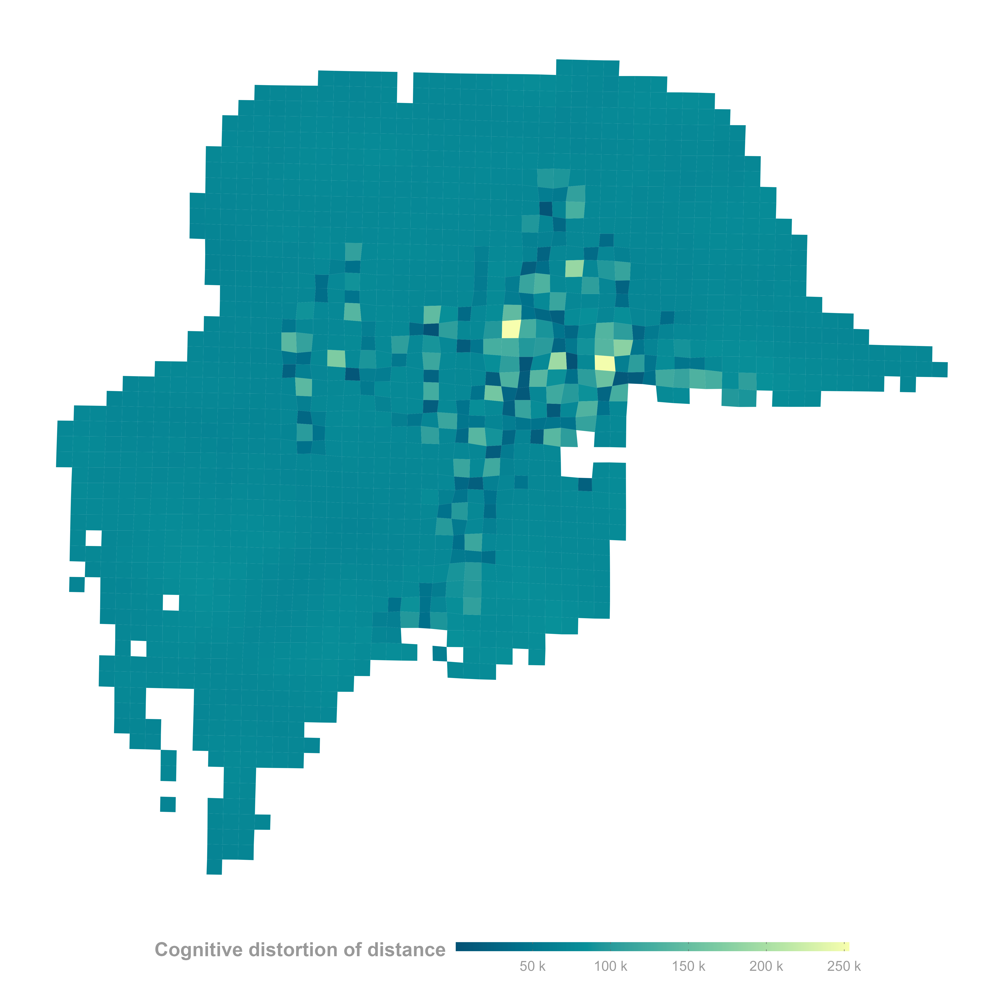

# Topological Cognition Maps for Urban Residents

This repository contains files and scripts for constructing topological cognition maps of urban residents based on **Topological Data Analysis (TDA)**. The project aims to analyze and visualize the spatial perceptions and movement patterns of urban residents by leveraging advanced computational techniques.

## Repository Structure

### Main Folders and Files
- **`data/`**: Folder for storing raw and processed data.
- **`img/`**: Contains visualization outputs, including cognitive maps.
  - `cmap_distance.png`: A distance-based visualization of cognitive maps.
  - `cong_map.png`: A topological cognition map showing urban movement patterns.
  - `cong_map_3d.png`: A 3D representation of congestion and spatial cognition.

### Notebooks and Scripts
- `linearRegression.ipynb`: A notebook implementing basic linear regression analysis.
- `linearRegression_all_params.ipynb`: Advanced regression analysis exploring various parameters.
- `linearRegression_lasso.ipynb`: Lasso regression analysis for feature selection.
- `mapper.ipynb`: The primary notebook for constructing topological cognition maps using TDA.
- `distoredMap.Rmd`: An R Markdown file for generating distorted cognition maps and documenting the analysis.

## Methodology

1. **Data Preparation**: Raw data is preprocessed and stored in the `data/` folder for further analysis.
2. **Topological Data Analysis**:
   - TDA tools are used to analyze spatial and cognitive patterns.
   - The `mapper.ipynb` script constructs the cognition maps by applying topological algorithms to the processed data.
3. **Visualization**: Cognitive maps are generated and stored in the `img/` folder for interpretation.
   - The maps provide insights into urban residents' spatial perceptions and movement behaviors.

## Outputs and Visualizations

### Visualization Samples

#### 3D Cognition Map

#### 2D Topological Cognition Map

#### Distance-based Distorted Cognitive Map

